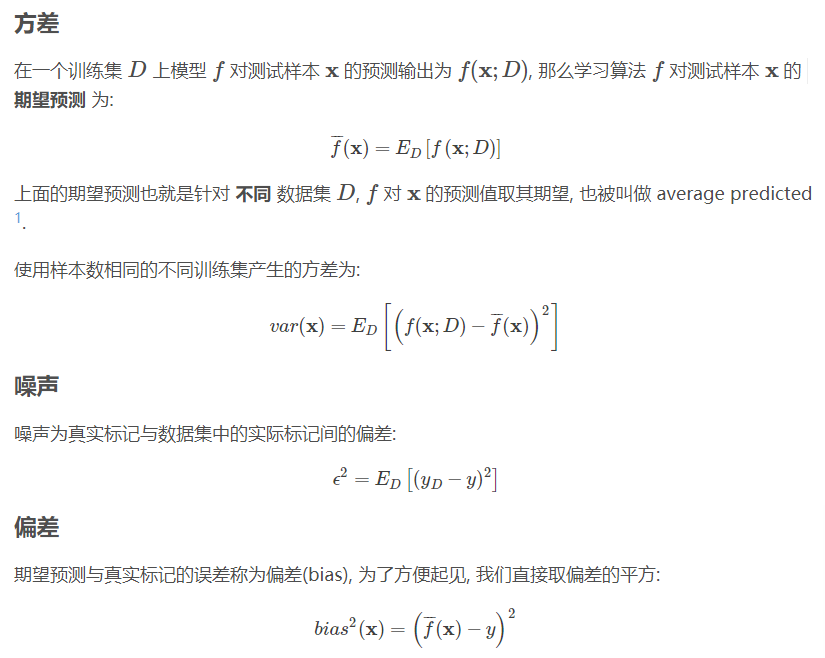

# GMM-UBM-speaker-model

## Content

- [1. 简述说话人识别流程](#简述说话人识别流程)
- [2. 什么是混合高斯模型GMM](#什么是混合高斯模型GMM)
- [3. 什么是通用背景模型UBM](#什么是通用背景模型UBM)
- [4. 什么是最大似然估计](#什么是最大似然估计)
- [5. EM算法](#EM算法)
- [6. GMM-UBM模型](#GMM-UBM模型)
- [7. 基本数学理论](#基本数学理论)
  
  - [7.1 泛化误差](#泛化误差)
  - [7.2 方差](#方差)
  - [7.3 期望](#期望)
- [8. 基本概念](#基本概念)
  - [8.1 TP TN FP FN](#tp-tn-fp-fn)

#### 1. 简述说话人识别流程 

1. 特征提取

   预加重、分帧加窗、傅里叶变换得到频谱图、再进行mel滤波使频谱图更紧凑、最后进行倒谱分析(取对数和离散余弦变换)和差分(提供一种动态特征)的到MFCC特征向量。

2. 训练模型

3. 打分判决

#### 2. 什么是混合高斯模型GMM 

1. GMM就是由多个单高斯分布混合而成的一个模型。
2. 为什么要混合：因为单个分布的话拟合能力不够。
3. 为什么要高斯：
   1. 因为高斯分布有很好的计算性质，他有一个自然数e，很自然就可以取对数将乘法变成加法。
   2. 同时高斯分布也有很好的理论支撑,从中心极限定理可知,如果采样最够多的话，n个采样的平均值x拔会符合高斯分布，他的均值就是变量的均值，方差等于变量方差/n，那么只要n足够大，就可以用平均数的高斯分布去近似随机变量的高斯分布。

#### 3. 什么是通用背景模型UBM 

1. UBM相当于一个大的混合高斯分布模型。
2. 目的：为了解决目标用户训练数据太少的问题，用大量非目标用户数据训练出一个拟合通用特征的大型GMM。

#### 4. 什么是最大似然估计 

最大似然估计是一种反推：就是你只已经知道模型了，同时你也有了观测数据，但是模型的参数是未知的，这时候肯定是算不出来准确的参数值的。那就可以把产生当前观测数据的可能性最大的参数当作估计值，这就是最大似然的含义，也就是最大可能性。

#### 5. EM算法 

1. EM算法的关键思想就是迭代求解。
2. 他有两个关键的步骤：期望步和最大化。
   1. 期望：先用上一轮迭代得到的参数计算出隐性变量(无法直接观测到的变量，比如统计身高分布，某个人是男是女无法观测到)的期望。
   2. 最大化：使用最大似然估计和这个期望值来算出新的参数。
      在混合高斯模型中，这个隐性变量实际上是描述数据由那个子高斯分布取样得到的，那他的期望实际上就是被某个子分布生成的概率。

#### 6. GMM-UBM模型 

1. 先使用大量的非目标用户数据训练UBM；
2. 然后使用MAP自适应算法和目标说话人数据来更新局部参数得到对应的GMM；
3. MAP自适应算法相当于先进性一轮EM迭代得到新的参数，然后将新参数和旧参数整合。

#### 7. 基本数学理论 

#### 7.1 泛化误差 

在统计学中, 一个随机变量的方差描述的是它的离散程度, 也就是该随机变量在其期望值附近的**波动程度**。

先从下面的靶心图来对方差与偏差有个直观的感受：

假设红色的靶心区域是学习算法完美的正确预测值, 蓝色点为每个数据集所训练出的模型对样本的预测值, 当我们从靶心逐渐向外移动时, 预测效果逐渐变差。

很容易看出有两副图中蓝色点比较集中, 另外两幅中比较分散, 它们描述的是方差的两种情况.。比较集中的属于**方差**小的, 比较分散的属于**方差大**的情况。

再从蓝色点与红色靶心区域的位置关系, 靠近红色靶心的属于**偏差**较小的情况, 远离靶心的属于**偏差**较大的情况.

不要被上面的公式吓到, 其实不复杂, 在已知结论的情况下, 了解每一项的意义, 就是一个十分简单的证明题而已, 蓝色部分是对上面对应的等价替换, 然后对其展开后, 红色部分刚好为 0.

对最终的推导结果稍作整理:

至此, 继续来看一下偏差, 方差与噪声的含义:

- **偏差**.

  偏差度量了学习算法的期望预测与真实结果的**偏离程度**, 即 刻画了学习算法本身的**拟合能力** .

- **方差**.

  方差度量了同样大小的训练集的变动所导致的**学习性能的变化**, 即刻画了数据扰动所造成的影响 .

- **噪声**.

  噪声表达了在当前任务上任何学习算法所能达到的期望泛化误差的下界, 即刻画了**学习问题本身的难度** . 巧妇难为无米之炊, 给一堆很差的食材, 要想做出一顿美味, 肯定是很有难度的.

想当然地, 我们希望偏差与方差越小越好, 但实际并非如此. 一般来说, 偏差与方差是有冲突的, 称为偏差-方差窘境 (bias-variance dilemma).

- 给定一个学习任务, 在训练初期, 由于训练不足, 学习器的拟合能力不够强, 偏差比较大, 也是由于拟合能力不强, 数据集的扰动也无法使学习器产生显著变化, 也就是欠拟合的情况;

- 随着训练程度的加深, 学习器的拟合能力逐渐增强, 训练数据的扰动也能够渐渐被学习器学到;

- 充分训练后, 学习器的拟合能力已非常强, 训练数据的轻微扰动都会导致学习器发生显著变化, 当训练数据自身的、非全局的特性被学习器学到了, 则将发生过拟合.
  

#### 7.2 方差 

中文名：方差，外文名：variance/deviation Var，类型：统计学，种类：离散型方差、连续型方差。

方差是在概率论和统计方差**衡量**随机变量或一组数据的**离散程度的度量**。概率论中方差用来度量随机变量和其数学期望（即均值）之间的**偏离程度**。统计中的方差（样本方差）是每个样本值与全体样本值的平均数之差的平方值的平均数。

为总体方差，为变量，为总体均值，为总体例数。

#### 7.3 期望 

**期望**：在概率论和统计学中，一个离散性随机变量的**期望值**（或**数学期望**，亦简称**期望**，物理学中称为**期待值**）是试验中每次可能的结果乘以其结果概率的总和。换句话说，期望值像是随机试验在同样的机会下重复多次，所有那些可能状态平均的结果，便基本上等同“期望值”所期望的数。期望值可能与每一个结果都不相等。换句话说，期望值是该变量输出值的加权平均。

例如，掷一枚公平的六面骰子，其每次“点数”的期望值是3.5，计算如下：

不过如上所说明的，3.5虽是“点数”的期望值，但却不属于可能结果中的任一个，没有可能掷出此点数。

赌博是期望值的一种常见应用。

如果是在概率空间中的随机变量，那么它的期望值的定义是：

如果是**离散**的随机变量，输出值为，和输出值相应的概率为（概率和为1）。

#### 8. 基本概念 

#### 8.1 TP TN FP FN 

这几个术语会高频率得出现在实验部分。

- **precesion**：查准率，即在检索后返回的结果中，真正正确的个数占整个结果的比例。
- **recall**：查全率，即在检索结果中真正正确的个数占整个数据集（检索到的和未检索到的）中真正正确个数的比例。
- **TP**：真阳性 True Positive,被判定为正样本，事实上也是正样本。
- **FP**：假阳性 False Positive,被判定为正样本，但事实上是负样本。
- **FN**：假阴性 False Negative,被判定为负样本，但事实上是正样本。
- **TN**：真阴性 True Negative,被判定为负样本，事实上也是负样本。

这里的正样本和负样本与检索的关系就是：你认为为正样本的应该都出现在检索结果中，而你认为为负样本的不应该出现在检索结果中，但是你认为的和事实上的会有不一样。

预测和实际**一致则为真**，预测和实际**不一致则为假**；如果**预测出来是“正”的，则为“阳”**，**预测结果为 “负”，则为“阴”**。

**记忆**：把缩写分为两个部分，第一个字母（F,T）和第二个字母（P,N）。首先搞清楚**第二个字母**，即它是**你认为该**样本的归属应该是怎样（Positive or Negative）；**第一个字母**即是**对你的判断进行的评价**（False or True）。这里也许中文可能会有不好理解的地方，所以我想用英文来描述，可能更清晰：第二个字母：What's your judgement about the sample?；第一个字母：Is your judgement right(true) or not(false)?

那么有：

- **precesion = TP/(TP+FP)** 即，检索结果中，都是你认为应该为正的样本（第二个字母都是P），但是其中有你判断正确的和判断错误的（第一个字母有T ，F）。

- **recall = TP/(TP+FN)**即，检索结果中，你判断为正的样本也确实为正的，以及那些没在检索结果中被你判断为负但是事实上是正的（FN）。不明白  

例子：

总共有100个人，其中60个人患有疾病，40个人是健康的。我们的要找出里面的病人，我们一共找出了50个我们认为的病人，其中40个确实是病人，另外10个是健康的。因为我们要找的是“病人”，所以“病人”就是正样本，健康者是负样本。

- TP 正阳性：预测为正，实际也为正，也就是预测为病人，实际也是病人的样本数目，一个有40个。

- FP 假阳性：预测为正，实际为负。预测为病人，但实际不是病人，有10个。

- FN 假阴性：预测为负，实际为正。我们找出了50个我们认为的病人，剩下50个我们认为都是健康的，但事实上剩下的50个人中，有20个是病人。这20个就是假阴性的数目。预测没病，但实际有病。

- TN 真阴性：预测为负，实际为负。我们找出了50个我们认为的病人，剩下的50个就是我们预测的负样本，但是这50个样本中，有20个是病人，剩下30个才是负样本，所以真阴性的个数为30。
  

