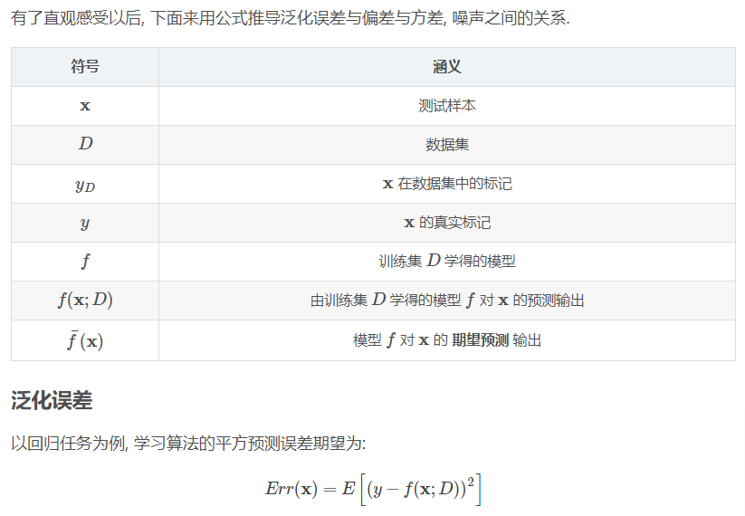
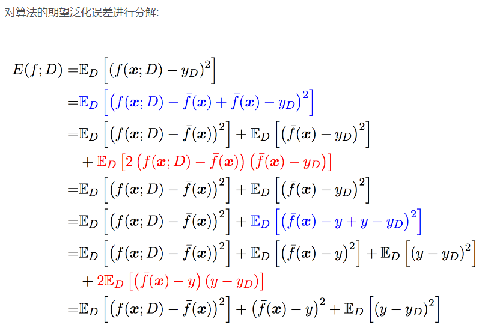
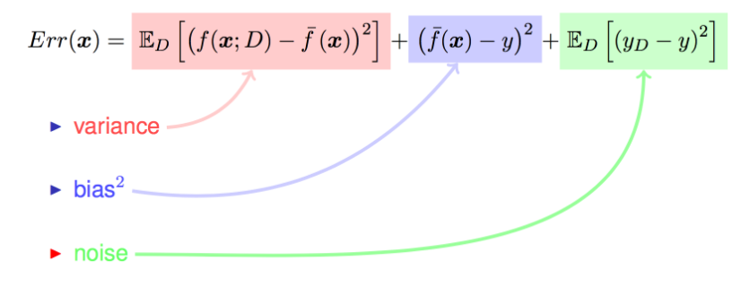

# GMM-UBM-speaker-model

## Content

- [1. 简述说话人识别流程](#简述说话人识别流程)
- [2. 什么是混合高斯模型GMM](#什么是混合高斯模型GMM)
- [3. 什么是通用背景模型UBM](#什么是通用背景模型UBM)
- [4. 什么是最大似然估计](#什么是最大似然估计)
- [5. EM算法](#EM算法)
- [6. GMM-UBM模型](#GMM-UBM模型)
- [7. 基本数学理论](#基本数学理论)
  
  - [7.1 泛化误差](#泛化误差)
  - [7.2 方差](#方差)
  - [7.3 期望](#期望)
- [8. 基本概念](#基本概念)
  - [8.1 TP TN FP FN](#tp-tn-fp-fn)
  - [8.2 数据的标准化和归一化](#数据的标准化和归一化)
  - [8.3 收敛问题](#收敛问题)

#### 1. 简述说话人识别流程 

1. 特征提取

   预加重、分帧加窗、傅里叶变换得到频谱图、再进行mel滤波使频谱图更紧凑、最后进行倒谱分析(取对数和离散余弦变换)和差分(提供一种动态特征)的到MFCC特征向量。

2. 训练模型

3. 打分判决

#### 2. 什么是混合高斯模型GMM 

1. GMM就是由多个单高斯分布混合而成的一个模型。
2. 为什么要混合：因为单个分布的话拟合能力不够。
3. 为什么要高斯：
   1. 因为高斯分布有很好的计算性质，他有一个自然数e，很自然就可以取对数将乘法变成加法。
   2. 同时高斯分布也有很好的理论支撑,从中心极限定理可知,如果采样最够多的话，n个采样的平均值x拔会符合高斯分布，他的均值就是变量的均值，方差等于变量方差/n，那么只要n足够大，就可以用平均数的高斯分布去近似随机变量的高斯分布。

#### 3. 什么是通用背景模型UBM 

1. UBM相当于一个大的混合高斯分布模型。
2. 目的：为了解决目标用户训练数据太少的问题，用大量非目标用户数据训练出一个拟合通用特征的大型GMM。

#### 4. 什么是最大似然估计 

最大似然估计是一种反推：就是你只已经知道模型了，同时你也有了观测数据，但是模型的参数是未知的，这时候肯定是算不出来准确的参数值的。那就可以把产生当前观测数据的可能性最大的参数当作估计值，这就是最大似然的含义，也就是最大可能性。

#### 5. EM算法 

1. EM算法的关键思想就是迭代求解。
2. 他有两个关键的步骤：期望步和最大化。
   1. 期望：先用上一轮迭代得到的参数计算出隐性变量(无法直接观测到的变量，比如统计身高分布，某个人是男是女无法观测到)的期望。
   2. 最大化：使用最大似然估计和这个期望值来算出新的参数。
      在混合高斯模型中，这个隐性变量实际上是描述数据由那个子高斯分布取样得到的，那他的期望实际上就是被某个子分布生成的概率。

#### 6. GMM-UBM模型 

1. 先使用大量的非目标用户数据训练UBM；
2. 然后使用MAP自适应算法和目标说话人数据来更新局部参数得到对应的GMM；
3. MAP自适应算法相当于先进性一轮EM迭代得到新的参数，然后将新参数和旧参数整合。

#### 7. 基本数学理论 

#### 7.1 泛化误差 

在统计学中, 一个随机变量的方差描述的是它的离散程度, 也就是该随机变量在其期望值附近的**波动程度**。

先从下面的靶心图来对方差与偏差有个直观的感受：

假设红色的靶心区域是学习算法完美的正确预测值, 蓝色点为每个数据集所训练出的模型对样本的预测值, 当我们从靶心逐渐向外移动时, 预测效果逐渐变差。

很容易看出有两副图中蓝色点比较集中, 另外两幅中比较分散, 它们描述的是方差的两种情况.。比较集中的属于**方差**小的, 比较分散的属于**方差大**的情况。

再从蓝色点与红色靶心区域的位置关系, 靠近红色靶心的属于**偏差**较小的情况, 远离靶心的属于**偏差**较大的情况.

不要被上面的公式吓到, 其实不复杂, 在已知结论的情况下, 了解每一项的意义, 就是一个十分简单的证明题而已, 蓝色部分是对上面对应的等价替换, 然后对其展开后, 红色部分刚好为 0.

对最终的推导结果稍作整理:

至此, 继续来看一下偏差, 方差与噪声的含义:

- **偏差**.

  偏差度量了学习算法的期望预测与真实结果的**偏离程度**, 即 刻画了学习算法本身的**拟合能力** .

- **方差**.

  方差度量了同样大小的训练集的变动所导致的**学习性能的变化**, 即刻画了数据扰动所造成的影响 .

- **噪声**.

  噪声表达了在当前任务上任何学习算法所能达到的期望泛化误差的下界, 即刻画了**学习问题本身的难度** . 巧妇难为无米之炊, 给一堆很差的食材, 要想做出一顿美味, 肯定是很有难度的.

想当然地, 我们希望偏差与方差越小越好, 但实际并非如此. 一般来说, 偏差与方差是有冲突的, 称为偏差-方差窘境 (bias-variance dilemma).

- 给定一个学习任务, 在训练初期, 由于训练不足, 学习器的拟合能力不够强, 偏差比较大, 也是由于拟合能力不强, 数据集的扰动也无法使学习器产生显著变化, 也就是欠拟合的情况;

- 随着训练程度的加深, 学习器的拟合能力逐渐增强, 训练数据的扰动也能够渐渐被学习器学到;

- 充分训练后, 学习器的拟合能力已非常强, 训练数据的轻微扰动都会导致学习器发生显著变化, 当训练数据自身的、非全局的特性被学习器学到了, 则将发生过拟合.
  

#### 7.2 方差 

中文名：方差，外文名：variance/deviation Var，类型：统计学，种类：离散型方差、连续型方差。

方差是在概率论和统计方差**衡量**随机变量或一组数据的**离散程度的度量**。概率论中方差用来度量随机变量和其数学期望（即均值）之间的**偏离程度**。统计中的方差（样本方差）是每个样本值与全体样本值的平均数之差的平方值的平均数。

为总体方差，为变量，为总体均值，为总体例数。

#### 7.3 期望 

**期望**：在概率论和统计学中，一个离散性随机变量的**期望值**（或**数学期望**，亦简称**期望**，物理学中称为**期待值**）是试验中每次可能的结果乘以其结果概率的总和。换句话说，期望值像是随机试验在同样的机会下重复多次，所有那些可能状态平均的结果，便基本上等同“期望值”所期望的数。期望值可能与每一个结果都不相等。换句话说，期望值是该变量输出值的加权平均。

例如，掷一枚公平的六面骰子，其每次“点数”的期望值是3.5，计算如下：

不过如上所说明的，3.5虽是“点数”的期望值，但却不属于可能结果中的任一个，没有可能掷出此点数。

赌博是期望值的一种常见应用。

如果是在概率空间中的随机变量，那么它的期望值的定义是：

如果是**离散**的随机变量，输出值为，和输出值相应的概率为（概率和为1）。

#### 8. 基本概念 

#### 8.1 TP TN FP FN 

这几个术语会高频率得出现在实验部分。

- **precesion**：查准率，即在检索后返回的结果中，真正正确的个数占整个结果的比例。
- **recall**：查全率，即在检索结果中真正正确的个数占整个数据集（检索到的和未检索到的）中真正正确个数的比例。
- **TP**：真阳性 True Positive,被判定为正样本，事实上也是正样本。
- **FP**：假阳性 False Positive,被判定为正样本，但事实上是负样本。
- **FN**：假阴性 False Negative,被判定为负样本，但事实上是正样本。
- **TN**：真阴性 True Negative,被判定为负样本，事实上也是负样本。

这里的正样本和负样本与检索的关系就是：你认为为正样本的应该都出现在检索结果中，而你认为为负样本的不应该出现在检索结果中，但是你认为的和事实上的会有不一样。

预测和实际**一致则为真**，预测和实际**不一致则为假**；如果**预测出来是“正”的，则为“阳”**，**预测结果为 “负”，则为“阴”**。

**记忆**：把缩写分为两个部分，第一个字母（F,T）和第二个字母（P,N）。首先搞清楚**第二个字母**，即它是**你认为该**样本的归属应该是怎样（Positive or Negative）；**第一个字母**即是**对你的判断进行的评价**（False or True）。这里也许中文可能会有不好理解的地方，所以我想用英文来描述，可能更清晰：第二个字母：What's your judgement about the sample?；第一个字母：Is your judgement right(true) or not(false)?

那么有：

- precesion = TP/(TP+FP)即，检索结果中，都是你认为应该为正的样本（第二个字母都是P），但是其中有你判断正确的和判断错误的（第一个字母有T ，F）。

- recall = TP/(TP+FN)即，检索结果中，你判断为正的样本也确实为正的，以及那些没在检索结果中被你判断为负但是事实上是正的（FN）。

例子：

总共有100个人，其中60个人患有疾病，40个人是健康的。我们的要找出里面的病人，我们一共找出了50个我们认为的病人，其中40个确实是病人，另外10个是健康的。因为我们要找的是“病人”，所以“病人”就是正样本，健康者是负样本。

- TP 正阳性：预测为正，实际也为正，也就是预测为病人，实际也是病人的样本数目，一个有40个。

- FP 假阳性：预测为正，实际为负。预测为病人，但实际不是病人，有10个。

- FN 假阴性：预测为负，实际为正。我们找出了50个我们认为的病人，剩下50个我们认为都是健康的，但事实上剩下的50个人中，有20个是病人。这20个就是假阴性的数目。预测没病，但实际有病。

- TN 真阴性：预测为负，实际为负。我们找出了50个我们认为的病人，剩下的50个就是我们预测的负样本，但是这50个样本中，有20个是病人，剩下30个才是负样本，所以真阴性的个数为30。
  
#### 8.2 数据的标准化和归一化 

在机器学习领域中，不同评价指标（即特征向量中的不同特征就是所述的不同评价指标）往往具有不同的量纲和量纲单位，这样的情况会影响到数据分析的结果，为了消除指标之间的量纲影响，需要进行数据标准化处理，以解决数据指标之间的可比性。原始数据经过数据标准化处理后，各指标处于同一数量级，适合进行综合对比评价。其中，最典型的就是数据的归一化处理。

简而言之，归一化的目的就是使得预处理的数据被限定在一定的范围内（比如[0,1]或者[-1,1]），从而消除**奇异样本数据**导致的不良影响。

- 在统计学中，归一化的具体作用是归纳统一样本的统计分布性。归一化在0~1之间是统计的**概率分布**，归一化在-1~+1之间是统计的**坐标分布**。

- 奇异样本数据是指相对于其他输入样本特别大或特别小的样本矢量（即特征向量），譬如，下面为具有两个特征的样本数据x1、x2、x3、x4、x5、x6（特征向量—>列向量）,其中x6这个样本的两个特征相对其他样本而言相差比较大，因此，x6认为是奇异样本数据。

  

  奇异样本数据的存在会引起训练时间增大，同时也可能导致无法收敛，因此，当存在奇异样本数据时，在进行训练之前需要对预处理数据进行归一化；反之，不存在奇异样本数据时，则可以不进行归一化。

**数据的标准化（normalization）**：

- 概念：是将数据按比例缩放，使之落入一个小的特定区间。在某些比较和评价的指标处理中经常会用到，去除数据的单位限制，将其转化为无量纲的纯数值，便于不同单位或量级的指标能够进行比较和加权。

- 方法：目前数据标准化方法有多种，归结起来可以分为**直线型方法**(如极值法、标准差法)、**折线型方法**(如三折线法)、**曲线型方法**(如半正态性分布)。不同的标准化方法，对系统的评价结果会产生不同的影响，然而不幸的是，在数据标准化方法的选择上，还没有通用的法则可以遵循。

- 典型：其中最典型的就是数据的**归一化处理**，即将数据统一映射到[0,1]区间上。

**解析范例**：

- 如果不进行归一化，那么由于特征向量中不同特征的取值相差较大，会导致目标函数变“扁”。这样在进行梯度下降的时候，梯度的方向就会偏离最小值的方向，走很多弯路，即训练时间过长。

  

- 如果进行归一化以后，目标函数会呈现比较“圆”，这样训练速度大大加快，少走很多弯路。

  

**归一化的目标**：

- 把数变为（0，1）之间的小数：主要是为了数据处理方便提出来的，把数据映射到0～1范围之内处理，更加便捷快速，应该归到数字信号处理范畴之内。
- 把有量纲表达式变为无量纲表达式：归一化是一种简化计算的方式，即将有量纲的表达式，经过变换，化为无量纲的表达式，成为纯量。 

- 另外，微波之中也就是电路分析、信号系统、电磁波传输等，有很多运算都可以如此处理，既保证了运算的便捷，又能凸现出物理量的本质含义。

**归一化后有两个好处**：

- 提升模型的收敛速度，加快了梯度下降求最优解的速度。

- 提升模型的精度，提高精度（如KNN）：

  归一化的另一好处是提高精度，这在涉及到一些距离计算的算法时效果显著，比如算法要计算欧氏距离，上图中x2的取值范围比较小，涉及到距离计算时其对结果的影响远比x1带来的小，所以这就会造成精度的损失。所以归一化很有必要，他可以让各个特征对结果做出的贡献相同。

  在多指标评价体系中，由于各评价指标的性质不同，通常具有不同的量纲和数量级。当各指标间的水平相差很大时，如果直接用原始指标值进行分析，就会突出数值较高的指标在综合分析中的作用，相对削弱数值水平较低指标的作用。因此，为了保证结果的可靠性，需要对原始指标数据进行标准化处理。

**数据分析**：

- 在数据分析之前，我们通常需要先将数据标准化（normalization），利用标准化后的数据进行数据分析。数据标准化也就是统计数据的指数化。
- 数据标准化处理主要包括数据同趋化处理和无量纲化处理两个方面。
- 数据同趋化处理主要解决不同性质数据问题，对不同性质指标直接加总不能正确反映不同作用力的综合结果，须先考虑改变逆指标数据性质，使所有指标对测评方案的作用力同趋化，再加总才能得出正确结果。数据无量纲化处理主要解决数据的可比性。经过上述标准化处理，原始数据均转换为无量纲化指标测评值，即各指标值都处于同一个数量级别上，可以进行综合测评分析。

**需要数据归一化的机器学习算法**：

- 有些模型在各个维度进行不均匀伸缩后，最优解与原来不等价，例如SVM（距离分界面远的也拉近了，支持向量变多？）。对于这样的模型，除非本来各维数据的分布范围就比较接近，否则必须进行标准化，以免模型参数被分布范围较大或较小的数据dominate。
- 有些模型在各个维度进行不均匀伸缩后，最优解与原来等价，例如logistic regression（因为θ的大小本来就自学习出不同的feature的重要性吧？）。对于这样的模型，是否标准化理论上不会改变最优解。但是，由于实际求解往往使用迭代算法，如果目标函数的形状太“扁”，迭代算法可能收敛得很慢甚至不收敛（模型结果不精确）。所以对于具有伸缩不变性的模型，最好也进行数据标准化。
- 有些模型/优化方法的效果会强烈地依赖于特征是否归一化，如LogisticReg，SVM，NeuralNetwork，SGD等。

**不需要归一化的模型**：

- 0/1取值的特征通常不需要归一化，归一化会破坏它的稀疏性。
- 有些模型则不受归一化影响，如DecisionTree。
- ICA好像不需要归一化（因为独立成分如果归一化了就不独立了？）。
- 基于平方损失的最小二乘法OLS不需要归一化。

#### 8.3 收敛问题 

**达不到收敛效果的可能原因**：

- **不收敛**一般是由于样本的信息量太大导致网络不足以fit住整个样本空间。数据分类标注是否准确？数据是否干净？样本少只可能带来过拟合的问题。如果只是validate set上不收敛那就说明overfitting了，这时候就要考虑各种anti-overfit的trick了，比如dropout，SGD，增大minibatch的数量，减少fc层的节点数量，momentum，finetune等。

- 为啥网络跑着跑着看着要收敛了**结果突然飞了**呢？可能性最大的原因是你用了relu作为激活函数的同时使用了softmax或者带有exp的函数做分类层的loss函数。当某一次训练传到最后一层的时候，某一节点激活过度（比如100），那么exp(100)=Inf，发生溢出，bp后所有的weight会变成NAN，然后从此之后weight就会一直保持NAN，于是loss就飞起来了。比如下面这个失败的实验中的loss曲线：

  

  其中红色是loss，绿色是accuracy。可以看出在2300左右的时候跑飞了一次，不过所幸lr设的并不是非常大所以又拉了回来。如果lr设的过大会出现跑飞再也回不来的情况。这时候你停一下随便挑一个层的weights看一看，很有可能都是NAN了。对于这种情况建议用二分法尝试。0.1~0.0001.不同模型不同任务最优的lr都不一样。

- **尽量收集更多的数据**。有个方法是爬flickr，找名人标签，然后稍微人工剔除一下就能收集一套不错的样本。其实收集样本不在于多而在于hard，比如你收集了40张基本姿态表情相同的同一个人的图片不如收集他的10张不同表情的图片。之前做过试验，50张variance大的图per person和300多张类似的图per person训练出来的模型后者就比前者高半个点。

- **尽量用小模型**。如果数据太少尽量缩小模型复杂度。考虑减少层数或者减少kernel number。

- 首先你要**保证训练的次数够多**，不要以为一百两百次就会一直loss下降或者准确率一直提高，会有一点震荡的。只要总体收敛就行。若训练次数够多（一般上千次，上万次，或者几十个epoch）没收敛，再分析其他原因。

- **学习率设定不合理**。在自己训练新网络时，可以从0.1开始尝试，如果loss不下降的意思，那就降低，除以10，用0.01尝试，一般来说0.01会收敛，不行的话就用0.001. 学习率设置过大，很容易震荡。不过刚刚开始不建议把学习率设置过小，尤其是在训练的开始阶段。在开始阶段我们不能把学习率设置的太低否则loss不会收敛。我的做法是逐渐尝试，从0.1,0.08,0.06,0.05 ......逐渐减小直到正常为止。有的时候候学习率太低走不出低估，把冲量提高也是一种方法，适当提高mini-batch值，使其波动不大。

- **网络设定不合理**。如果做很复杂的分类任务，却只用了很浅的网络，可能会导致训练难以收敛，换网络换网络换网络，重要的事情说三遍，或者也可以尝试加深当前网络。

- **数据集label的设置**。检查lable是否有错，有的时候图像类别的label设置成1，2，3正确设置应该为0,1,2。

- **改变图片的大小**，[可以看这篇文章](https://blog.csdn.net/Fighting_Dreamer/article/details/71498256)。

- **数据归一化**，神经网络中对数据进行归一化是不可忽略的步骤，网络能不能正常工作，还得看你有没有做归一化，一般来讲，归一化就是减去数据平均值除以标准差，通常是针对每个输入和输出特征进行归一化。

  

